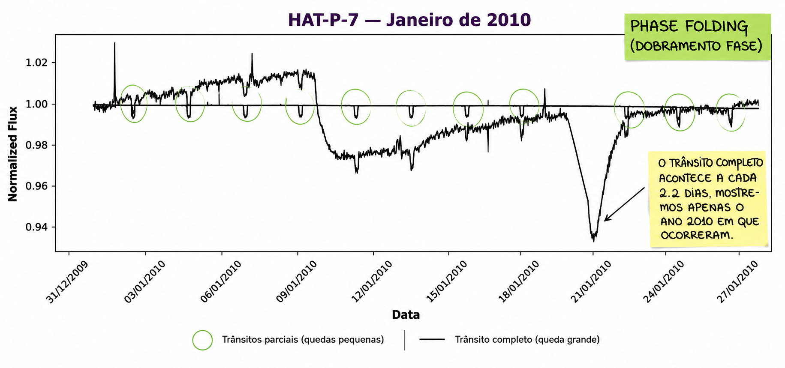

 

 

### Data Scientist • Developer • Machine Learning for Astronomy

 

 

  

---

## ✨ About Me

I'm a **Data Scientist** and **Developer** passionate about transforming complex data into meaningful knowledge.

My main interests lie in **Machine Learning**, **Scientific Computing** and **Astronomy**, especially in the analysis of astronomical data, light curves and exoplanet detection.

Currently, I'm developing projects that combine **Artificial Intelligence**, **Data Engineering** and **Software Development** while preparing for a future Master's degree in Astronomy.

> *"The mystery of human existence lies not in just staying alive, but in finding something to live for."*  
> **— Fyodor Dostoevsky, The Brothers Karamazov**

---

# 🚀 Tech Stack

## 💻 Programming Languages

---

## 🤖 Data Science & Artificial Intelligence

---

## 🌌 Astronomy

---

## 🛰️ Geospatial Analysis

## 🗺️ Maps, APIs & Integrations

- Google Maps JavaScript API
- Google Geocoding API
- Google Places API
- Route Calculation
- Interactive Maps
- Marker Clustering
- Custom Map Pins
- Geolocation
- Spatial Visualization
- API Integrations

## ⚙️ Backend Development

---

## 🎨 Front-end Development

---

## 🗄️ Databases

---

## 🛠️ Development Tools

---

## 🌠 Research Interests

- 🪐 Exoplanet Detection
- 📈 Time Series Analysis
- 🌌 Astronomical Data Pipelines
- 🤖 Machine Learning
- 📊 Scientific Computing
- ⭐ Variable Stars
- 🔭 Photometry
- 🛰️ Astronomical Surveys

---

## 📚 Currently Learning

- Astropy
- Lightkurve
- Bayesian Statistics
- Signal Processing
- Computational Astrophysics
- Advanced Machine Learning

---

## 📊 GitHub Statistics

---

### 🌌 *"Ad Astra per Scientiam."*

