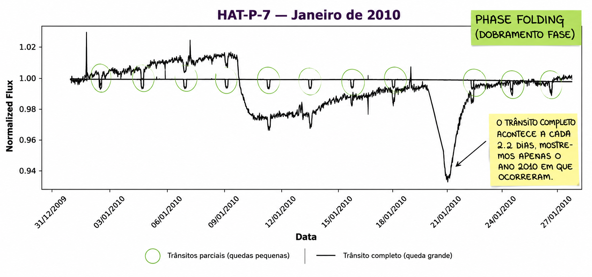

  
# 🌌 Nichole Nicolini

**Data Science • Machine Learning • Computational Astronomy**

 

---

### About Me

Computer Science student focused on applying **Machine Learning** and **data pipelines** to astronomical problems, especially the analysis of **light curves** and exoplanet transit signals.

I am currently developing **Orbitalia**, my undergraduate thesis project: a collaborative platform for standardization and automated classification of light curves observed by amateur astronomers.

My background combines software development with growing experience in scientific data analysis.

---

### 🚀 Current Project

**Orbitalia** *(Undergraduate Thesis – 2026)*  
Collaborative platform for preprocessing and automated classification of light curves from amateur astronomers.

- Pipeline for ingestion, cleaning and standardization of photometric data  
- Machine Learning models for classifying transit signals vs false positives  
- Evaluation of how data standardization impacts classification performance  
- Integration of collaborative observations with automated analysis

> Goal: support citizen science contributions in exoplanet research by making heterogeneous amateur data more usable.

---

### Tech Stack (main tools I actually use)

**Data & ML**  
`Python` `Pandas` `scikit-learn` `NumPy` `Matplotlib` `Jupyter`

**Astronomy**  
`Lightkurve` `Astropy` `FITS` `Photometry` `Light Curves`

**Development**  
`React` `Next.js` `TypeScript` `Node.js` `PostgreSQL`

---

### Research Interests

- Exoplanet detection via transit method  
- Time series analysis of light curves  
- Data pipelines for astronomical observations  
- Machine Learning applied to citizen science data  
- Standardization of heterogeneous photometric data

---

### Currently Working On

- Developing and evaluating the Orbitalia classification pipeline  
- Improving feature extraction from light curves  
- Preparing for a Master's degree in Astronomy / Computational Astrophysics

---

### GitHub Stats

  
  

---

  
*"Ad Astra per Scientiam."*

